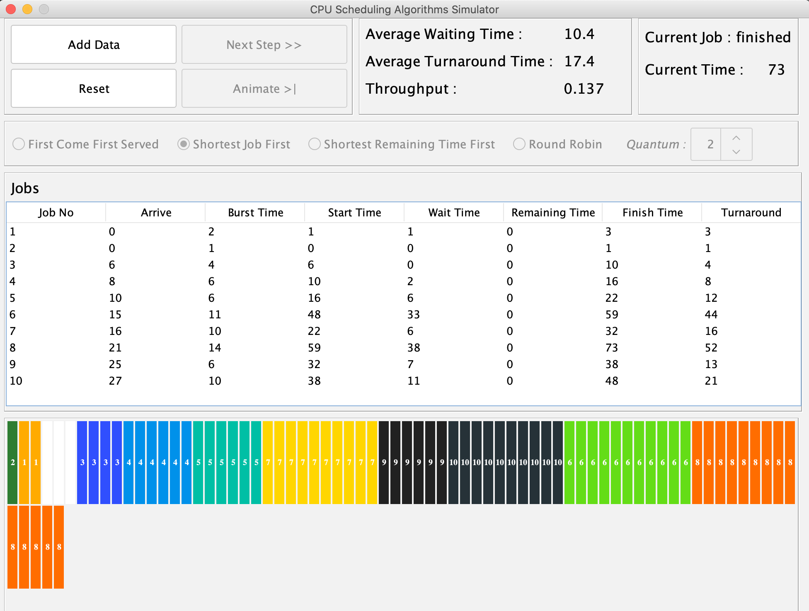
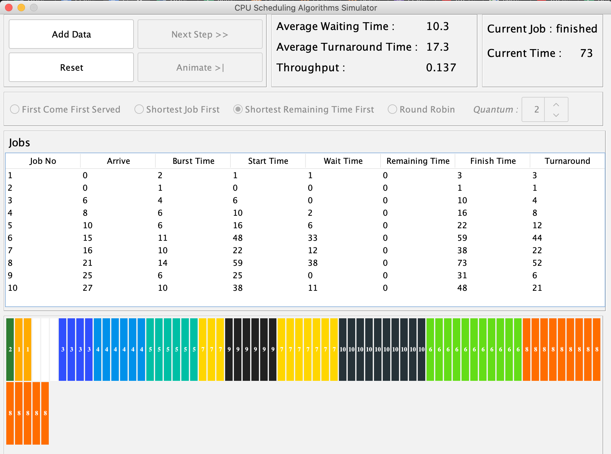

# CPU-Scheduling-Algorithms-Simulator

A Java application to simulate First Come First Served (FCFS), Shortest Job First (SJF), Shortest Remaining Time First(SRTF), Round Robin(RR) simulating algorithms and show Gantt charts, throughput, average waiting time, average turnaround time.
Developed as the mini project for Computer Organization And Operating Systems Subject.

<strong> Implemented algorithms: </strong>

## First Come First Served (FCFS)

## Shortest Job First (SJF)

## Shortest Remaining Time First(SRTF)

## Round Robin(RR)

